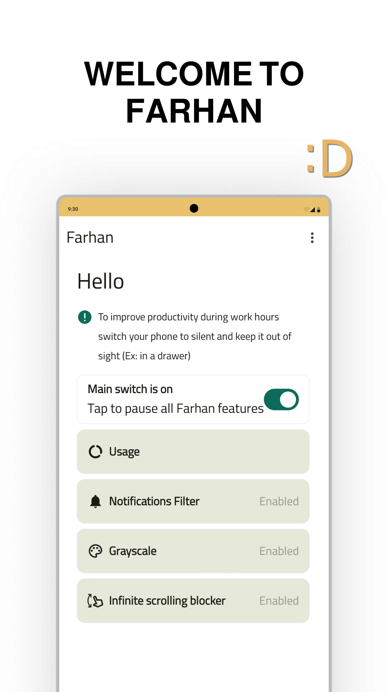
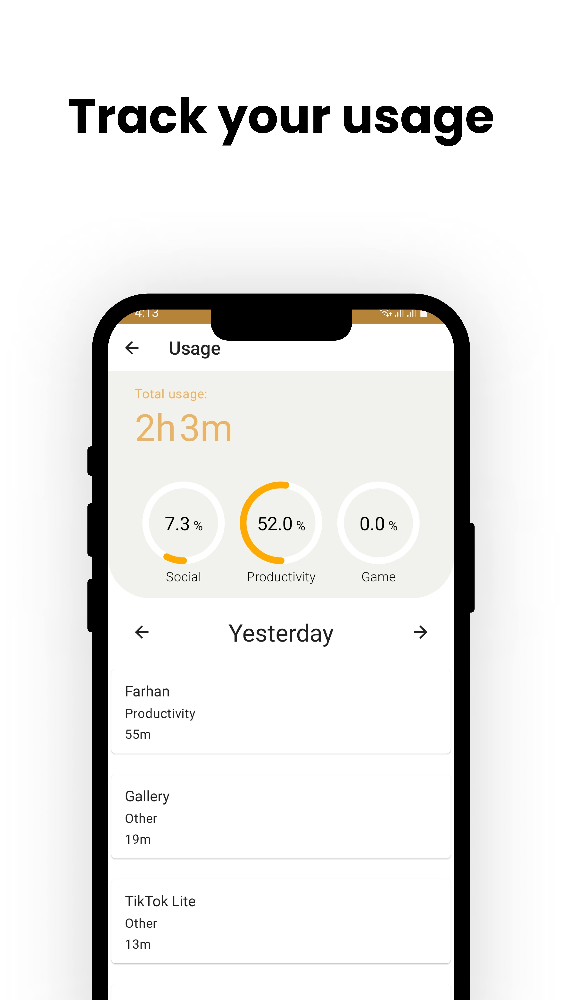
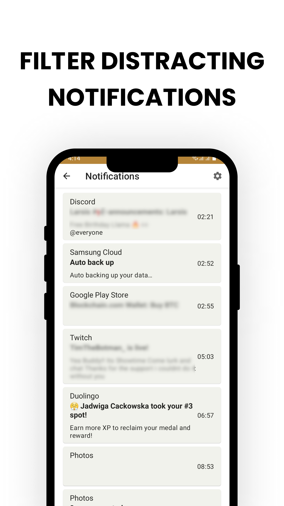
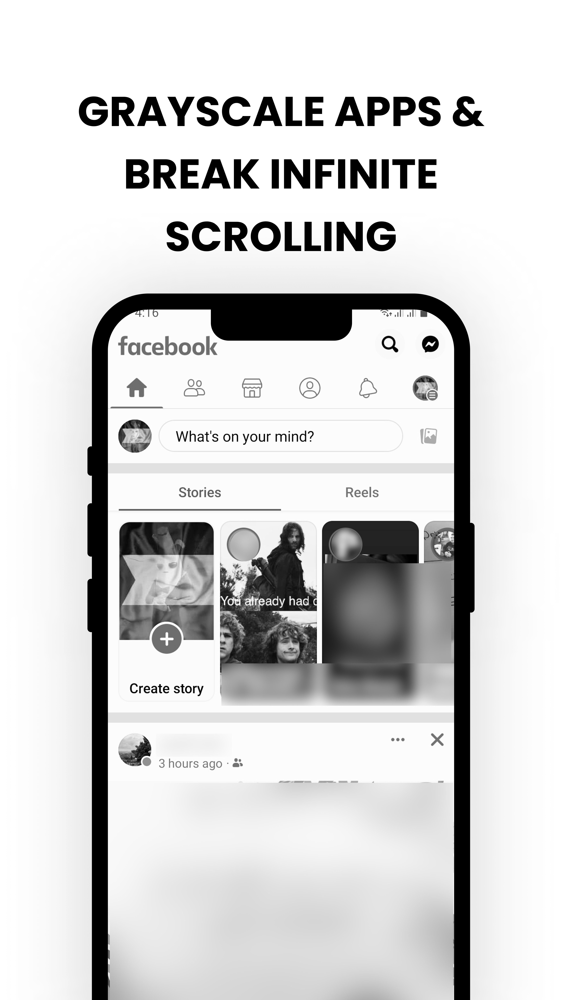
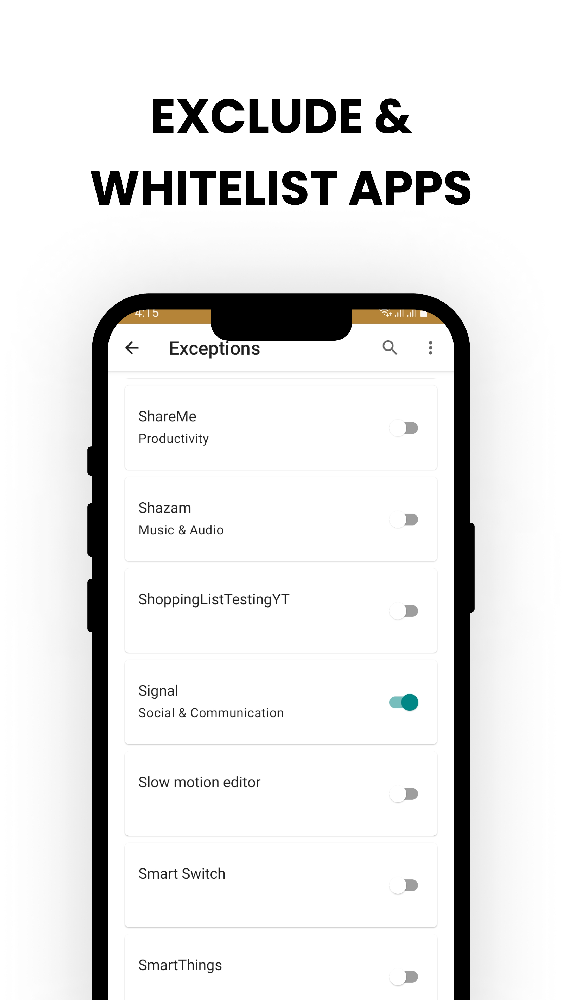
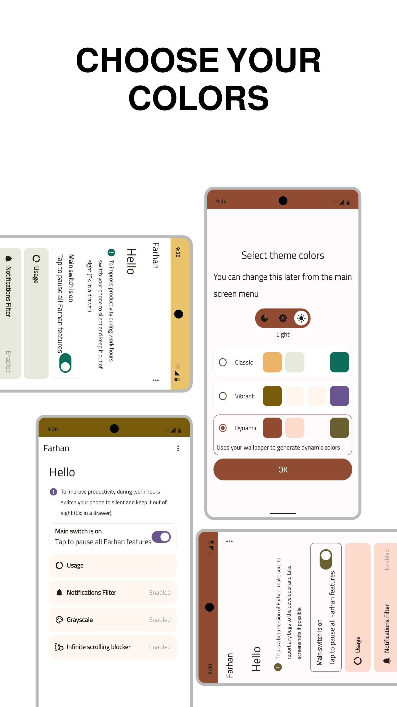

# Farhan

Farhan is an open-source application that offers many ways to eliminate manipulative strategies used
by other apps on your phone, so you can eliminate distractions and use your phone!
Included features:

## 1. Notifications filter

Filters notifications for you so you never get distracted, you won't notice them but you can always
exclude important apps so they won't get filtered and you can always check filtered notifications
from within the app.

## 2. Infinite scrolling blocker

Ever realized that you've spent so much time in social media scrolling? not anymore Infinite
scrolling blocker will remind you when it detects infinite scrolling behavior and will help you get
out of that app.

## 3. Screen Grayscale

Colors can be used to attract your brain and keep you in apps for longer, select what apps you want
to grayscale and enjoy a color free experience with no red badges or bright colors that catch your
attention.

## 4. Check your usage

Check your usage for every app & for different categories with a simple easy to use interface.

## Screenshots

## Contributing

Pull requests are welcome.

- Please follow the project's architecture.
- For major changes, please open an issue first to discuss what you would like to change.
- Please make sure to write tests for your code and update tests as appropriate.
- If you have any questions or you’re not sure about something please reach out and I’ll try to
  help.

## License

[MIT](https://choosealicense.com/licenses/mit/)
